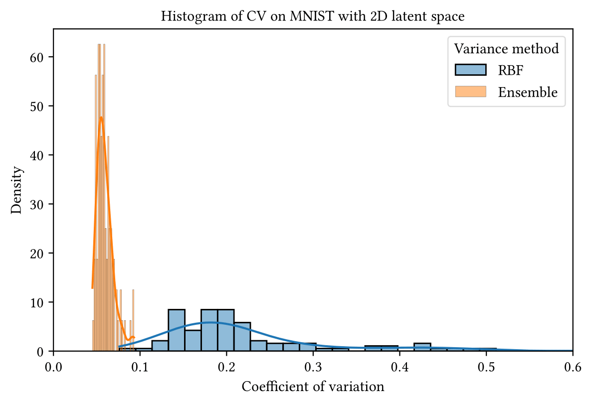

# Official Implementation of "Decoder ensembling for learned latent geometries"

This repository contains the official implementation of the paper:  
**[Decoder ensembling for learned latent geometries](https://arxiv.org/abs/2408.07507)**  
by Stas Syrota, Pablo Moreno-Muñoz and Søren Hauberg.

## Abstract

Latent space geometry provides a rigorous and empirically valuable framework for interacting with the latent variables of deep generative models. This approach reinterprets Euclidean latent spaces as Riemannian through a pull-back metric, allowing for a standard differential geometric analysis of the latent space. Unfortunately, data manifolds are generally compact and easily disconnected or filled with holes, suggesting a topological mismatch to the Euclidean latent space. The most established solution to this mismatch is to let uncertainty be a proxy for topology, but in neural network models, this is often realized through crude heuristics that lack principle and generally do not scale to high-dimensional representations. We propose using ensembles of decoders to capture model uncertainty and show how to easily compute geodesics on the associated expected manifold. Empirically, we find this simple and reliable, thereby coming one step closer to easy-to-use latent geometries.

## Requirements

To install the required dependencies, run:
```bash
python3 -m pip install jax[cuda12] 
python3 -m pip install torch==2.2.0 torchvision==0.17.0 --index-url https://download.pytorch.org/whl/cpu
python3 -m pip install .
```

## Usage

### Hydra configurations

We use [Hydra](https://hydra.cc/) for configuration management. The configuration files are located in the `configs` directory and are split up into separate sub-configs for the `datamodule`, `decoder`, `encoder`, `optimizer`, etc. configs. You can override any configuration parameter by passing it as a command-line argument. For example, to change the batch size, run:
```bash
python ./scripts/train.py datamodule.batch_size=64
```
### Training

To train a model with the basic config, run:
```bash
python ./scripts/train.py
```

### Evaluation

To evaluate the model (compute geodesics and create plots), run:
```bash
python ./scripts/train.py
```

## Results
The main advantage of using the geodesic distances in a latent space of a generative model is to be able to follow the data manifold, motivated by the manifold hypothesis. In case of data distributed along a circle in 2D, we would like to see something like:


The geodesics follow the data manifold and avoid the empty space in the middle. However, ensuring that the geodesics follow the data manifold is not trivial as artefacts such as holes are difficult to learn. Following prior work, we use the uncertainty of the decoder to guide the geodesics. This approach is motivated by the fact that uncertainty will be high in areas with no data, hence penalizing the geodesics that go through these areas. In our experiments we compare geodesics computed with uncertainty stemming from the ensemble of decoders with geodesics computed with uncertainty stemming from the RBF kernel. We show that the geodesics computed with the ensemble of decoders is more robust than the geodesics computed with the RBF kernel. The following plot shows the histogram of the coefficient of variation under 30 repetitions of the training procedure for the two methods. 



Examples of the geodesics with uncertainty visualized:

Ensembles:


RBF:


## Citation

If you use this code in your research, please cite the paper:
```bibtex
@misc{syrota2024decoderensemblinglearnedlatent,
      title={Decoder ensembling for learned latent geometries}, 
      author={Stas Syrota and Pablo Moreno-Muñoz and Søren Hauberg},
      year={2024},
      eprint={2408.07507},
      archivePrefix={arXiv},
      primaryClass={stat.ML},
      url={https://arxiv.org/abs/2408.07507}, 
}
}
```

## License

This project is licensed under the MIT License - see the [LICENSE](LICENSE) file for details.
